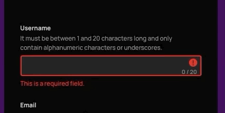

# Realtime Forms

This module is designed to not just be a system of validation, but a system of form logic that lies beneath your UI framework. It handles the data structures and validation processes, potential disabling of inputs, as well as the general lifecycle of a form (editing, submitting, etc.). All of these elements are updated in realtime and can be visualised to the user in realtime.

----

The form validation logic in this, unlike other validation systems, is:

- **Contextual** (errors are displayed where they are needed, usually at the input itself)
- **Granular** (errors tell the user exactly what error they made)
- **Realtime** (errors can display as the user is inputting data*)

*\*you can set to trigger realtime validation at different points of a user's interaction so errors don't have to be shown immediately to the user.*

---

I've spent quite a long time working on this and refined it quite a lot, but this package should still be considered an early project. It has plenty of flaws in it's current state (like it relies on quite a lot of boilerplate to function).

I'm publishing this at the moment in case anyone is interested in this kind of functionality as well as to get feedback. I've decided to not publish this on Elm packages yet because it still might be rough around the edges, but you can use elm-git-install to install it instead.

---

## How to use

The modules themselves have been documented but this package currently lacks a broad overview of how to implement it. This will happen in the future once this is improved on more.

Check out [realtime-forms-test](https://github.com/dzuk-mutant/realtime-forms-test) for an example of this code in practice.

---

## Improvement goals

- Reduce the amount of input boilerplate ie. all of the arguments that have to be used in functions like `Form.updateField` and `Form.validateField`.
	- This might not be possible given that the form system has to manage multiple data types.
- Generally improve some data structures, particularly when it comes to HTTP-related errors.
- Enable HTTP requests on individual form changes, like a username form that tells someone whether a  username has been taken or not without needing to make a submission attempt first.

---

## License

realtime-forms is licensed BSD-3-Clause.
